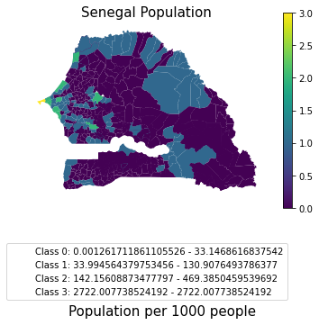

# Google Earth Engine + WorldPop Project 

The WorldPop project tracks population estimates using remote sensing technique as well as a variety of methods described [here](https://www.worldpop.org/methods). This repo uses the Google Earth Engine Python API to access WorldPop population estimates by Sahel administration boundaries and vizualizes results using PySAL and GeoPandas.

## Example Image

